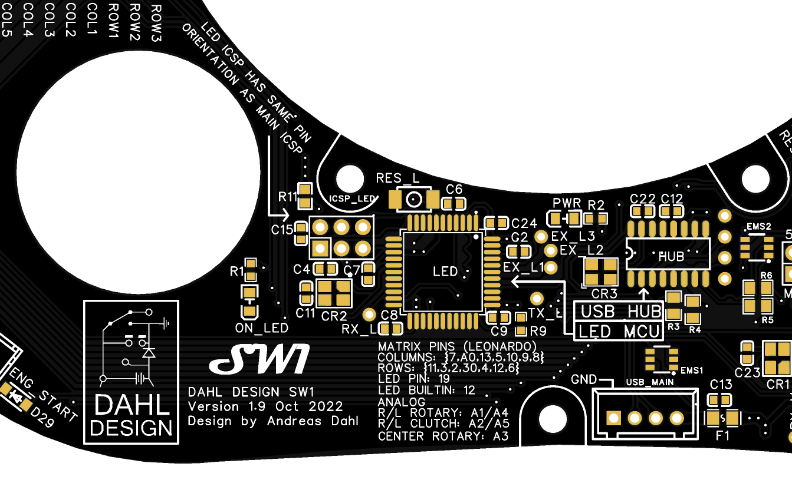

[![Contributors][contributors-shield]][contributors-url]
[![Forks][forks-shield]][forks-url]
[![Stargazers][stars-shield]][stars-url]
[![Issues][issues-shield]][issues-url]

<!-- PROJECT LOGO -->
 

    
  </a>

  <h2 align="center">DAHL DESIGN   DDC</h2>

  <h3 
 Universal controller firmware</h3>
  
<h4 
 1/4 of the quadfecta 
     
    <a href="https://github.com/andreasdahl1987/DahlDesignProperties">Properties</a>
    ·
    <a href="https://github.com/andreasdahl1987/DahlDesignLED">LED</a>
    ·
    <a href="https://github.com/andreasdahl1987/DahlDesignDash">Dashboard</a>
    ·
    <a href="https://github.com/andreasdahl1987/DahlDesignDDC">DDC</a>
  

  <h5 align="center">Welcome to the repository!      

[Wiki](https://github.com/andreasdahl1987/DahlDesignDDC/wiki) is under construction, but has come a long way. It should be enough to get you started. 

See my webpage www.dahldesign.eu for more info.

Demo video on YouTube: https://www.youtube.com/watch?v=LvadQq7CFOc

The old, and a bit outdated .pdf manual found [here](https://drive.google.com/drive/folders/1nRIrunK4o9ceeFzw6Bxu9pcchanQ1Gem).

<!-- MARKDOWN LINKS & IMAGES -->
<!-- https://www.markdownguide.org/basic-syntax/#reference-style-links -->
[contributors-shield]: https://img.shields.io/github/contributors/andreasdahl1987/DahlDesignDDC.svg?style=for-the-badge
[contributors-url]: https://github.com/andreasdahl1987/DahlDesignDDC/graphs/contributors
[forks-shield]: https://img.shields.io/github/forks/andreasdahl1987/DahlDesignDDC.svg?style=for-the-badge
[forks-url]: https://github.com/andreasdahl1987/DahlDesignDDC/network/members
[stars-shield]: https://img.shields.io/github/stars/andreasdahl1987/DahlDesignDDC.svg?style=for-the-badge
[stars-url]: https://github.com/andreasdahl1987/DahlDesignDDC/stargazers
[issues-shield]: https://img.shields.io/github/issues/andreasdahl1987/DahlDesignDDC.svg?style=for-the-badge
[issues-url]: https://github.com/andreasdahl1987/DahlDesignDDC/issues
