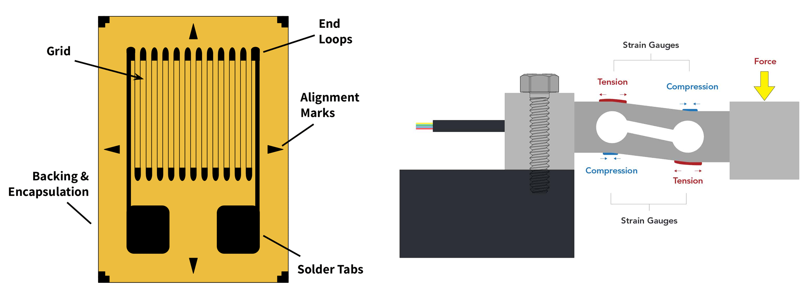

# Load cell

<figure><figcaption></figcaption></figure>

A strain gauge load cell is an instrument that allows you to measure force. For game controllers it is mostly used in high quality brake pedals. This piece of metal has built in strain gauges, which essentially are resistors that change resistance based on how much they are streched and compressed. They are aligned with the surface of the metal rod, and as the rod is flexed, the resistance in the circuit will change. The load cell will output a voltage linear with the force applied to flex the rod.&#x20;

<figure><figcaption>
On the left is a strain gauge, on the right is a load cell with four strain gauges
</figcaption></figure>

There are two hurdles with load cells however:

* The output voltage is extremely low, peaking at around 0.02 V.&#x20;
* The output voltage can be both positive and negative. Most ADCs (analog to digital converters) found in microcontroller chips don't support measuring negative voltages.&#x20;

The solution is a load cell amplifier with a built-in high precision ADC. DDC supports the HX711, which is a popular choice among DIYers. This handy little chip will amplify the signal voltage 128 times and measure the voltage with 24 bit resolution (4000 times the resolution of RP2040s built-in ADCs). It has a sample rate of 80 Hz, meaning you'll have an updated value almost every 0.01 seconds, fast enough for most projects.&#x20;

DDC only supports a single HX7111, meaning a single load cell. This is not an absolute limit, but rather a more practical approach, as it makes the programming part much tidier for the user, and very rarely will anyone need several load cell amplifiers in their project.

