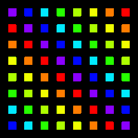

# 4. Connect to SimHub

A DDC controller connects to SimHub in two different ways, to achieve two different tings. I suggest you explore both of them.&#x20;

### 1: [LED Control](simhub-control.md)

<figure><figcaption></figcaption></figure>

Set up your controller as an LED device and use SimHub to control your RGB LEDs. The RGB editor lets you use game telemetry to achieve effects like rev lights, flag lights and much more.&#x20;

### 2:[ Controller settings and properties](connect-to-simhub/)

<figure><figcaption></figcaption></figure>

A DDC controller also sends controller settings, bitepoint and more over USB. SimHub can pick up on this and create properties for you to use in the dashboard editor. This is done through the DDC plugin.&#x20;
