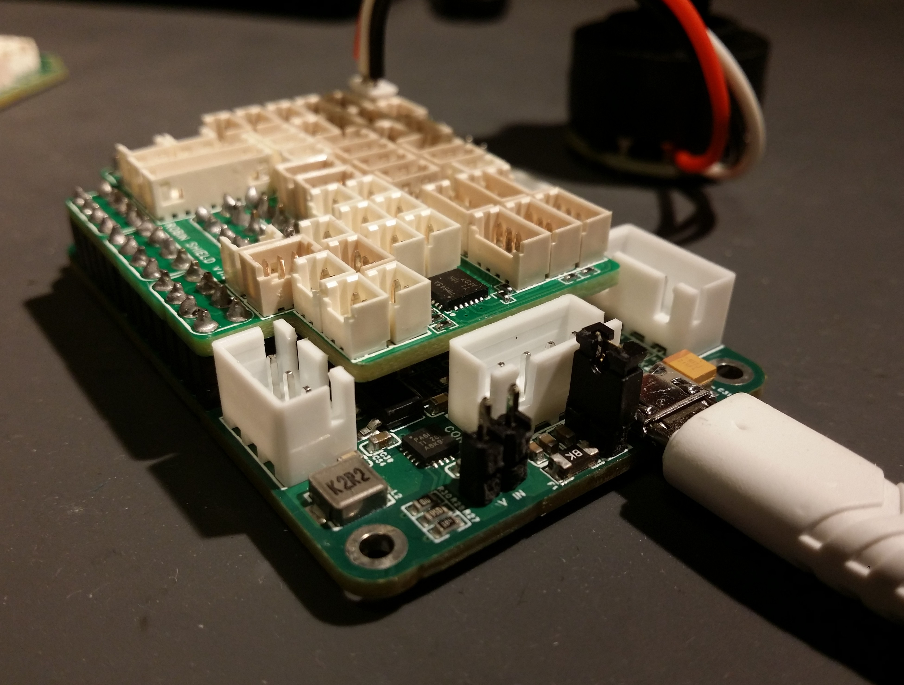

# Robin

This shield is named after Robin Mineur, who has brought the I2C MUX, OLED features and much of the software behind this to DDC. He’s also contributed with several switch functions and spent hours beta-testing new additions to the software.

<figure><figcaption>
The Robin shield alone
</figcaption></figure>

### Features

*   **1.25 mm pitch Molex Picoblade connectors**

    * _**2-pin x 15**_
      * 13 for buttons/toggles
      * 1 for  5V up to 3A current
      * 1 for 3.3V up to 1A current
    * _**3-pin x 22**_
      * 12 for analog inputs
      * 10 for encoders or 3-way toggles
    * 4-pin x 6
      * 6 for I2C devices&#x20;
        * Requires CB1 V1.3 or higher, inputs 1|1 and 1|2 will stop working if you use the I2C bus, activated by solder bridging I2C pads on the back of the CB1 board.
    *   8-pin x 2

        * 2 for funky switches

    This allows you to connect 10 encoders, 13 buttons, 12 multi-position switches/clutches/potentiometers, 2 funky switches and 6 I2C devices (sensors, OLED displays) to this shield. \

    If you need more encoders or buttons, you can mix and match with the other connectors. For instance, a 8-pin connector could also be used for 7 buttons or 3 encoders and a button. A 3-pin connector can be used for two buttons. Even the analog input connectors can be used for buttons. \

    You also have access to the 5V and 3.3V buses with 2-pin connectors, if you need to power anything. These can supply up to 3A and 1A, respectively. \

    In addition, there are two extra USB connectors for USB devices (screens, other controller boards) and a dedicated, level shifted LED line on the CB1 board.

<figure><figcaption>
The shield in place on a CB1 board
</figcaption></figure>

### Pinout diagram

The shield is so tightly packed that it doen't having any labeling. Use the pinout diagram below.&#x20;

<figure><figcaption></figcaption></figure>

### Schematics and PCB design

The schematics and PCB design are found together with the[ CB1 project.](https://oshwlab.com/andreasdahl1987/dahl-design-cb1)

<figure><figcaption></figcaption></figure>

### Ordering

Order the shield using the [same approach as with the CB1,](../ordering/) in this case there arent any components to exclude, and the board is a simple 2-layer board.&#x20;

Usually I have a bit of stock on these boards, so you could also reach out to me on the [discord server.](https://discord.com/invite/49btqWNmCc)&#x20;
