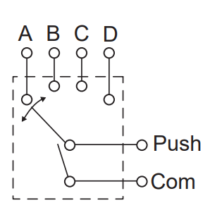

# Funky switch

<figure><figcaption></figcaption></figure>

Alps RKJXT1F42001, or just "funky switch". It has an encoder, covered under [funkyRotary](encoders/funkyrotary.md), 4 directional button presses and 1 center pushbutton.

<figure><figcaption></figcaption></figure>

As you can see from the schematic above, no directional input (A,B,C,D) will find its way to common pin unless pushbutton also i pressed. This is how this switch works. The pushbutton is pressed in every directional input. It serves as a pushbutton, but is also designed to prevent bouncing, by only closing the circuit to common when the switch is properly in place. This gives us a problem to solve however, since the center pushbutton is always engaged. We'll need an algorithm that avoids producing a button press if the pushbutton is pressed together with a directional button press. That is why funky switches have their own pushbutton functions.&#x20;

#### funkyButton()



A simple, momentary pushbutton. The button numer is the one you set in your matrix setup.



`void funkyButton(int row, int column, int pCol, int Col1, int Col2, int Col3)`

Fill in the row all the funky pins go to, the column of the one you're making the switch function for, the column of the center push buttons and the other 3 columns for the other 3 directional pushes:

`funkyButton(2,1,5,2,3,4);`



* 1 button number



#### funkyButtonL()



A simple, latching pushbutton. The button numer is the one you set in your matrix setup.



`void funkyButtonL(int row, int column, int pCol, int Col1, int Col2, int Col3)`

Fill in the row all the funky pins go to, the column of the one you're making the switch function for, the column of the center push buttons and the other 3 columns for the other 3 directional pushes:

`funkyButtonL(2,1,5,2,3,4);`



* 1 button number



#### funkyButtonM()



Pushbutton with two modes:

* 0: Momentary
* 1: Latching

Uses the button field.&#x20;



`void funkyButtonM(int row, int column, int fieldPlacement, int pCol, int Col1, int Col2, int Col3)`

Fill in the row all the funky pins go to, the column of the one you're making the switch function for, the field placement, the column of the center push buttons and the other 3 columns for the other 3 directional pushes:

`funkyButtonL(2,1,3,5,2,3,4);`

Here the field placement is set to 3. So you'll find the mode of this switch in the 3rd bit of the button field. Corresponding SimHub property is \[DahlDesign.DDCB3].&#x20;



* modButton() if you want to change modes freely. modButton() not needed to change modes across presets.
* 1 button number



#### <mark style="background-color:blue;">funkyButtonHybrid()</mark>



Any switch function that uses a hybrid button will be <mark style="background-color:blue;">highlighted blue.</mark>

A switch dedicated to opening/closing switches with hybrid features, such as DDS functions, rotaryAnalog(), rotary2Modes(), and a few more.

Does not have a button number.



`void funkyButtonHybrid(int row, int column, int pCol, int Col1, int Col2, int Col3)`

Fill in the row all the funky pins go to, the column of the one you're making the switch function for, the column of the center push buttons and the other 3 columns for the other 3 directional pushes:

`funkyButtonHybrid(2,1,5,2,3,4);`



None



#### funkyButtonDDButton()



A switch dedicated to swapping between the two "layers" of 12 positions if a DDS switch.

Does not have a button number.



`void funkyButtonDDButton(int row, int column, int pCol, int Col1, int Col2, int Col3)`

Fill in the row all the funky pins go to, the column of the one you're making the switch function for, the column of the center push buttons and the other 3 columns for the other 3 directional pushes:

`funkyButtonDDButton(2,1,5,2,3,4);`



None


